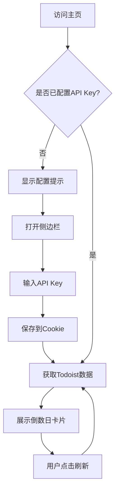

# Todoist 倒数日计时器 - 产品需求文档

## 1. 产品概述

一个纯前端的 Web 应用，通过 Todoist API 获取带有 @CountDown 标签的任务，将每个任务转换为美观的倒数日卡片展示。
用户可以直观地查看重要日期的倒数天数，帮助更好地管理和关注即将到来的重要事件。

## 2. 核心功能

### 2.1 用户角色
本产品无需用户注册，所有用户均为匿名用户，通过配置 Todoist API Key 来访问个人数据。

### 2.2 功能模块

我们的倒数日计时器包含以下主要页面：
1. **主页面**：卡片画廊展示、刷新按钮、侧边栏切换
2. **配置侧边栏**：API Key 配置、设置保存

### 2.3 页面详情

| 页面名称 | 模块名称 | 功能描述 |
|----------|----------|----------|
| 主页面 | 卡片画廊 | 以网格布局展示倒数日卡片，每个卡片包含任务名称、倒数天数、截止日期 |
| 主页面 | 刷新按钮 | 重新获取 Todoist 数据并更新卡片显示 |
| 主页面 | 侧边栏切换 | 显示/隐藏配置侧边栏的切换按钮 |
| 主页面 | 空状态提示 | 当未配置 API Key 时显示 "Please Set Your API Key First" |
| 配置侧边栏 | API Key 输入 | 输入框用于配置 Todoist API Key |
| 配置侧边栏 | 保存设置 | 将 API Key 保存到 Cookie（有效期一年） |

## 3. 核心流程

用户首次访问时需要在侧边栏配置 Todoist API Key，配置完成后系统自动获取带有 @CountDown 标签的任务并展示为倒数日卡片。用户可以随时点击刷新按钮更新数据。

## 4. 用户界面设计

### 4.1 设计风格

- **主色调**：深蓝色 (#1e3a8a) 和浅蓝色 (#3b82f6)
- **辅助色**：灰色 (#6b7280) 用于次要文本
- **按钮样式**：圆角按钮，带有轻微阴影效果
- **字体**：系统默认字体，标题使用 24px，正文使用 16px，小字使用 14px
- **布局风格**：卡片式布局，响应式网格设计
- **图标风格**：简洁的线性图标

### 4.2 页面设计概览

| 页面名称 | 模块名称 | UI 元素 |
|----------|----------|----------|
| 主页面 | 卡片画廊 | 响应式网格布局，每个卡片包含白色背景、圆角边框、轻微阴影 |
| 主页面 | 卡片内容 | 顶部任务名称（粗体），中间大字号倒数天数（蓝色），底部灰色日期文本 |
| 主页面 | 刷新按钮 | 右上角圆形按钮，蓝色背景，白色刷新图标 |
| 主页面 | 侧边栏切换 | 左上角汉堡菜单图标 |
| 配置侧边栏 | 侧边栏容器 | 左侧滑出面板，白色背景，带有阴影 |
| 配置侧边栏 | API Key 输入 | 标准输入框，带有标签和占位符文本 |
| 配置侧边栏 | 保存按钮 | 蓝色背景按钮，白色文字 |

### 4.3 响应式设计

桌面优先设计，支持移动端自适应。在移动设备上卡片将调整为单列布局，侧边栏将以全屏覆盖方式显示。