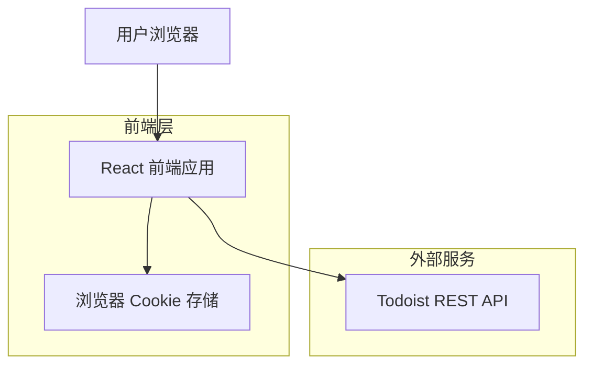
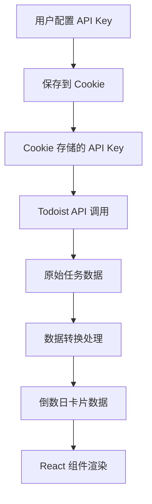

# Todoist 倒数日计时器 - 技术架构文档

## 1. 架构设计



## 2. 技术描述

* **前端**：React\@18 + TypeScript + Tailwind CSS + Vite

* **后端**：无（纯前端应用）

* **数据存储**：浏览器 Cookie（API Key 存储）

* **外部 API**：Todoist REST API v2

## 3. 路由定义

| 路由 | 用途                  |
| -- | ------------------- |
| /  | 主页面，展示倒数日卡片画廊和配置侧边栏 |

## 4. API 定义

### 4.1 外部 API 调用

**Todoist 任务获取**

```
GET https://api.todoist.com/rest/v2/tasks
```

请求参数：

| 参数名称   | 参数类型   | 是否必需 | 描述                |
| ------ | ------ | ---- | ----------------- |
| filter | string | true | 过滤条件："@CountDown" |

请求头：

| 头部名称          | 值                   | 描述               |
| ------------- | ------------------- | ---------------- |
| Authorization | Bearer {api\_token} | Todoist API 认证令牌 |

响应示例：

```json
[
  {
    "id": "2995104339",
    "content": "重要会议",
    "due": {
      "date": "2024-02-15",
      "string": "Feb 15",
      "lang": "en",
      "is_recurring": false
    },
    "created_at": "2024-01-01T12:00:00.000000Z"
  }
]
```

### 4.2 核心类型定义

```typescript
// Todoist 任务类型
interface TodoistTask {
  id: string;
  content: string;
  due?: {
    date: string;
    string: string;
    lang: string;
    is_recurring: boolean;
  };
  created_at: string;
}

// 倒数日卡片数据类型
interface CountdownCard {
  id: string;
  title: string;
  daysLeft: number;
  dueDate: string;
  isOverdue: boolean;
}

// 应用配置类型
interface AppConfig {
  apiKey: string | null;
}
```

## 5. 数据模型

### 5.1 数据流设计



### 5.2 本地存储结构

**Cookie 存储**

* **键名**：`todoist_api_key`

* **值**：用户的 Todoist API Token

* **过期时间**：365 天

* **域**：当前域名

* **安全性**：HttpOnly=false（需要 JavaScript 访问）

### 5.3 数据处理逻辑

1. **日期计算**：使用 JavaScript Date 对象计算当前日期与任务截止日期的天数差
2. **过期处理**：负数天数表示已过期，显示为红色警告
3. **数据缓存**：在组件状态中缓存获取的任务数据，避免频繁 API 调用
4. **错误处理**：API 调用失败时显示友好的

